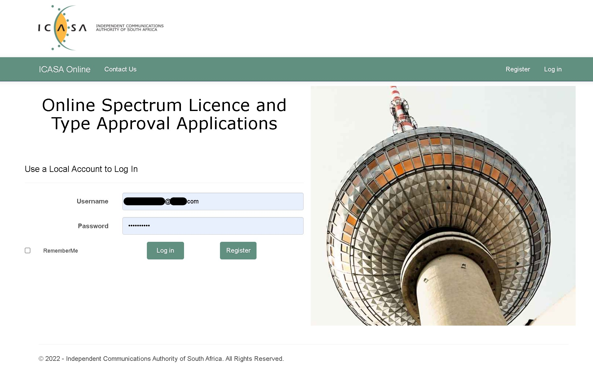
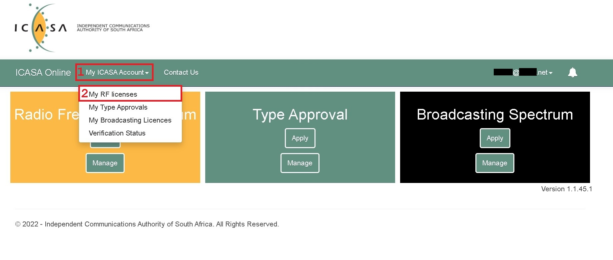
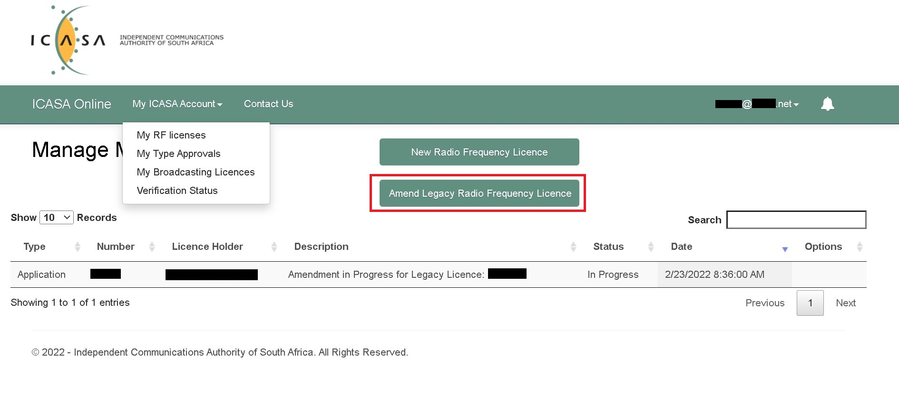
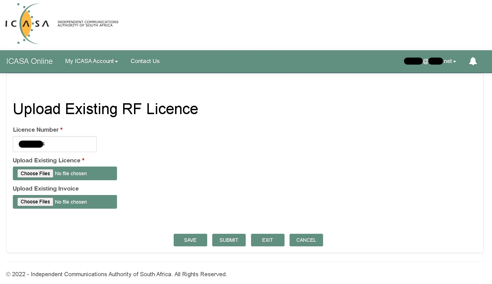

# Licence Renewal [Ham Radio South Africa]

This document shows you how to `Update` or `Register` your **Ham Radio** license on the new **_ICASA_** system in 2022.

Online Spectrum Licence and Type Approval Applications.

https://online.icasa.org.za

---

## STEPS 

_***N.B** Before you try any of these steps please make sure that your account is NOT managed by anyone else. If that is true then also make sure that your account has been verified._

* Summary of the steps:
    * 1. Make sure you have an account.
    * 2. Login to your account.
    * 3. Click on `My ICASA Account` > `My RF Licenses`.
    * 4. Click on the `Amend Legacy Radio Frequency Licence` button.
    * 5. Fill in your licence number and include a `.PDF` copy of your *payment invoice* and *licence certificate*.

---

# To Update Ham Radio Licence

### STEP 1

Make sure that you have an account on https://online.icasa.org.za and that it is not managed by anyone else.

### STEP 2
Login to your account.

### STEP 3
Click on `My ICASA Account` > `My RF Licenses`.

### STEP 4
Click on the `Amend Legacy Radio Frequency Licence` button.

### STEP 5
Fill in your licence number and include a `.PDF` copy of your *payment invoice* and *licence certificate*.

Now once the licence has been updated ICASA will send you your new 5 year licence.

