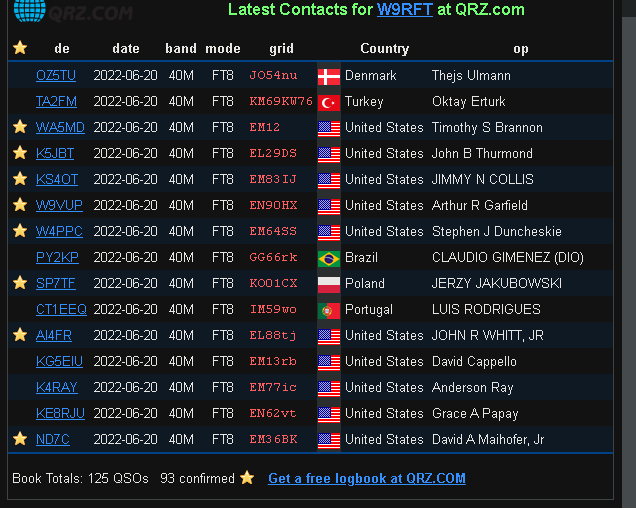
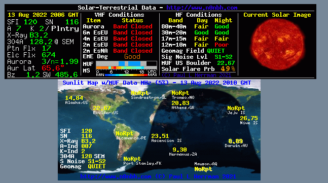

---

# Design documentation

## MARC Website Upgrade Suggestions ( Pietermaritzburg, KZN )

*Developed by C.A Torino, TECHRAD Radical Technology*
* Links to TECHRAD ZA.
    * [Website](https://www.techrad.co.za)
    * [Tutorial website](https://tutorials.techrad.co.za)
    * [Support website](https://support.techrad.co.za)
    * [F&Q](https://faq.techrad.co.za)

### Index

1. Consultation
2. Suggestions
3. Examples
4. Suggested Extras
5. Example Photos
6. Conclusion
7. Development History

---

### Consultation

MARC (midlands amature radio club) PMB website design choices on a gui template for the frontend.

Choosing a template and general improvments such as modernising saving club activitys to a database and functionality to write and save articles.

---

### Suggestions

After taking a look at the files I was able to determine that the MARC site is using the micro package look at [this](https://xneelo.co.za/insights/micro-and-micro-pro-packages-discontinued/) artical.

It explains that the micro package is no longer offered. The new basic package is [here](https://xneelo.co.za/web-hosting/) for viewing cost of R99.00 p/m.

The `micro plan` only offered 1 domain and no SQL database and is minimalistic in showing statistics etc.

The Basic hosting package at R99 per month offers the following features:

* WordPress AppInstaller.
* Unlimited traffic.
* 10 Multiple domains.
* 5GB SSD storage.
* 5 SSD Databases.
* 100 Mailboxes.
* 100 Email Aliases.

The reason I am bringing up these perks is because the `micro plan` severely restricts what upgrades ca be done on the current site.

I suggest upgrading to the `Basic hosting package at R99` per month if at all possible.

Once upgraded I can then install wordpress and connect the database and theme.

---

### Examples

Please see the example sites below:

* these are some ham website examples
    * http://hamradiocrashcourse.com/hrcc
    * https://zs6stn.org.za
    * http://www.parc.org.za
    * https://www.amateurradioshop.co.za
    * http://zs6tj-club.co.za
    * http://hamcity.co.za

However i would suggest a modern looking front-end like:
http://hamradiocrashcourse.com/hrcc or https://zs6stn.org.za

---

### Suggested Extras

I would also like to suggest:
 
* The addition of a self-testing frontend.
* The ability to add articles to the main site.
* The ability to add users/members.
* Adding a qrz iframe to the main site.
* Adding a solar-terrestrial iframe to the main site.
* Creating a simple free discord server for tutorials and FAQ related to MARC ham radio.
* Creating a simple free slack server for tutorials and FAQ related to MARC ham radio.
* Making a youtube channel and posting videos of events in conjunction with an article on the website.

In my opinion these will add more value to the site.

---

### Example Photos

QRZ iframe example for the main website.

Solar-Terrestrial iframe iframe example for the main website.

### Conclusion

I have created a backup of the current files and was able to determine a plan of action which includes wordpress but requires the `Basic hosting package at R99`.

This will make writing articles much easier because data can be saved to the SQL tables via wordpress, also themes can be easily changed via wordpress themes.

There is also unlimited data traffic and 10 subdomains for expanding sites and adding functionality etc.

The basic package also offeres 100 mailboxes and 5GB of storage for photos and files etc.

Best regards: Cale

MARC Site
https://www.marc.org.za

---

### Development History

**Planning and document compiling (13-August-2022)**

Markdown document created with a detailed report on the consultation, software needed, suggested improvments.

Example templates added to the report.

Breakdown of how the current site looks added to the report.

---

**Chat At Club Meeting (16-July-2022)**

Chat with Mike from [edelweb](https://edelweb.co.za/) mike@edelnet.co.za about website details how it is setup and basic improvements.

---

* Useful links
    * [view markdown files offline](https://stackoverflow.com/questions/9843609/view-markdown-files-offline).
    * [mastering markdown tutorial](https://guides.github.com/features/mastering-markdown/).
    * [markdown to pdf](https://www.markdowntopdf.com/).