# Reprogramming A Motorola CM140

[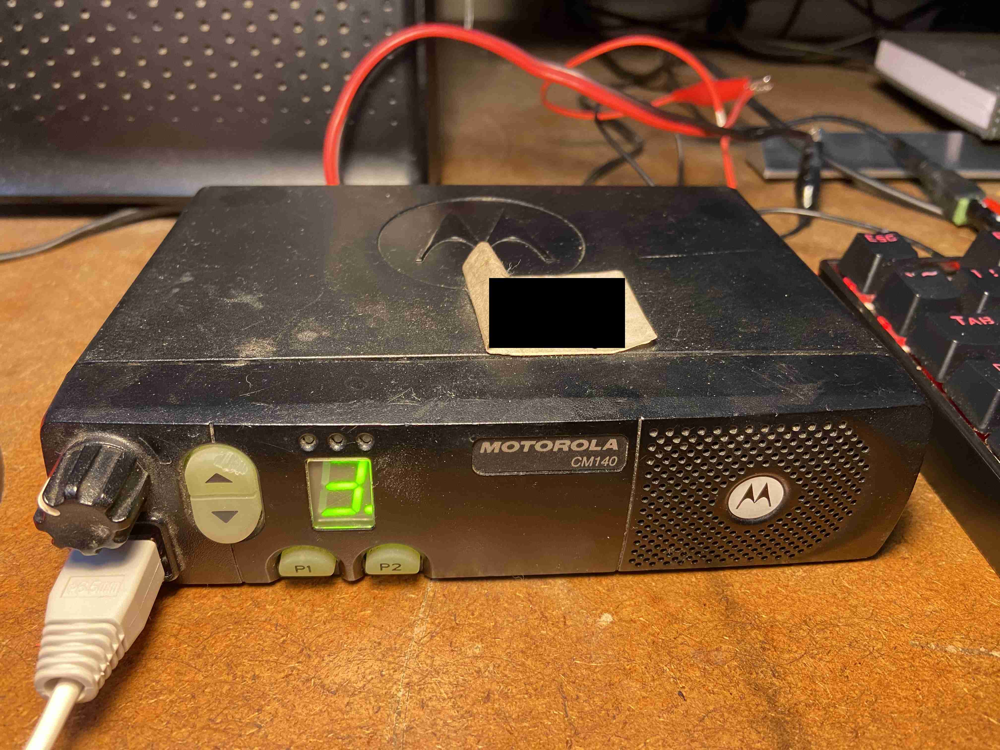](img/5.JPG)

Follow the steps below.

---

### 1. Programming Cable

[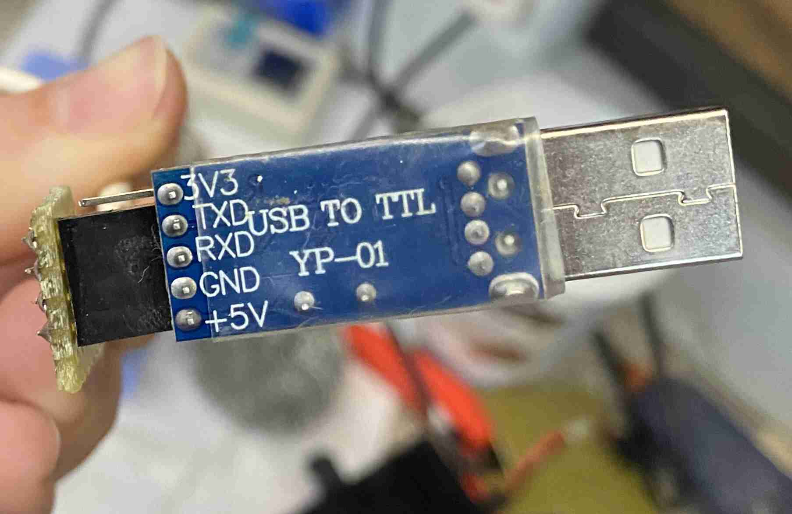](img/2.JPG)

We first need to make sure there is a programming cable for the radio.

This *Motorola CM140* can use **USB TTL => RJ45**

If you need to make one follow my schematic below.

[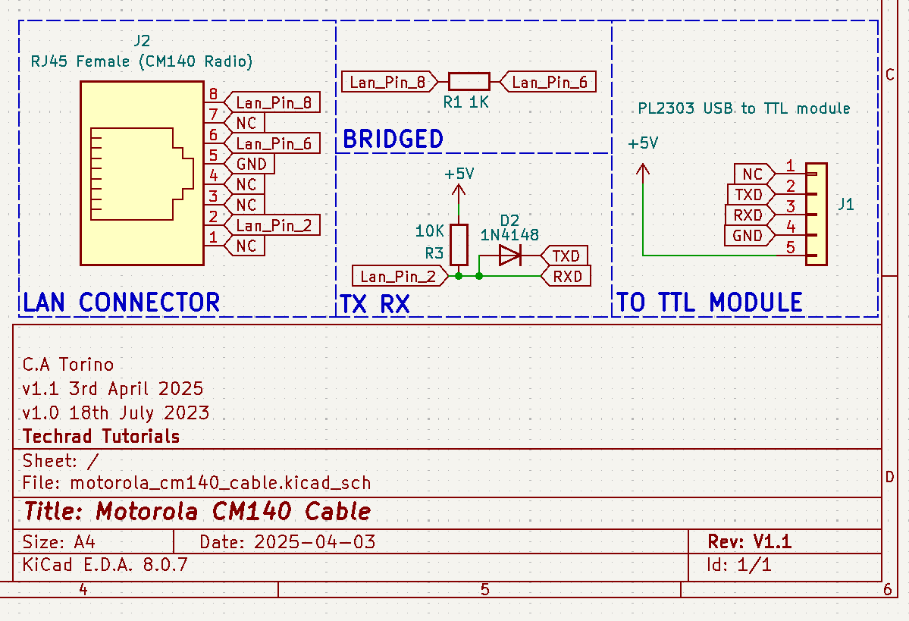](img/6.png)

[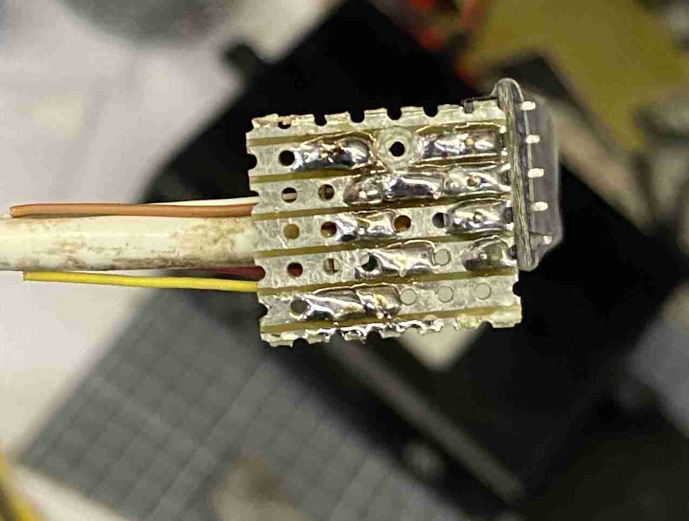](img/3.JPG)

[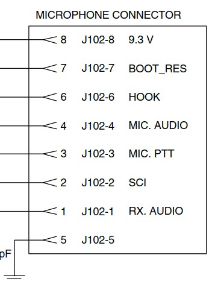](img/22.jpg)

---

### 2. Programming Cable Driver

[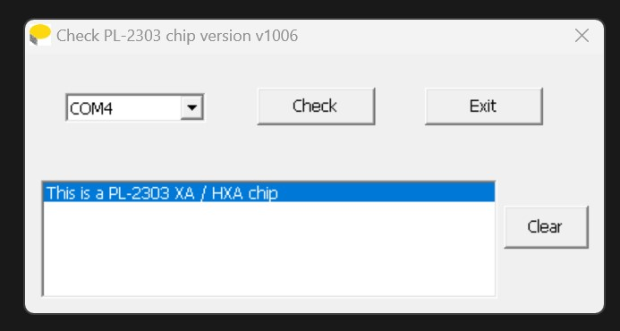](img/8.jpg)

Now we can setup the driver for the `HKD PL2303 USB to TTL module`.

A module in South Africa can be found here [here](https://www.communica.co.za/products/hkd-pl2303-usb-to-ttl-module?variant=31916110446665 "HKD PL2303 USB to TTL module").

R 27.00 (inc VAT)

[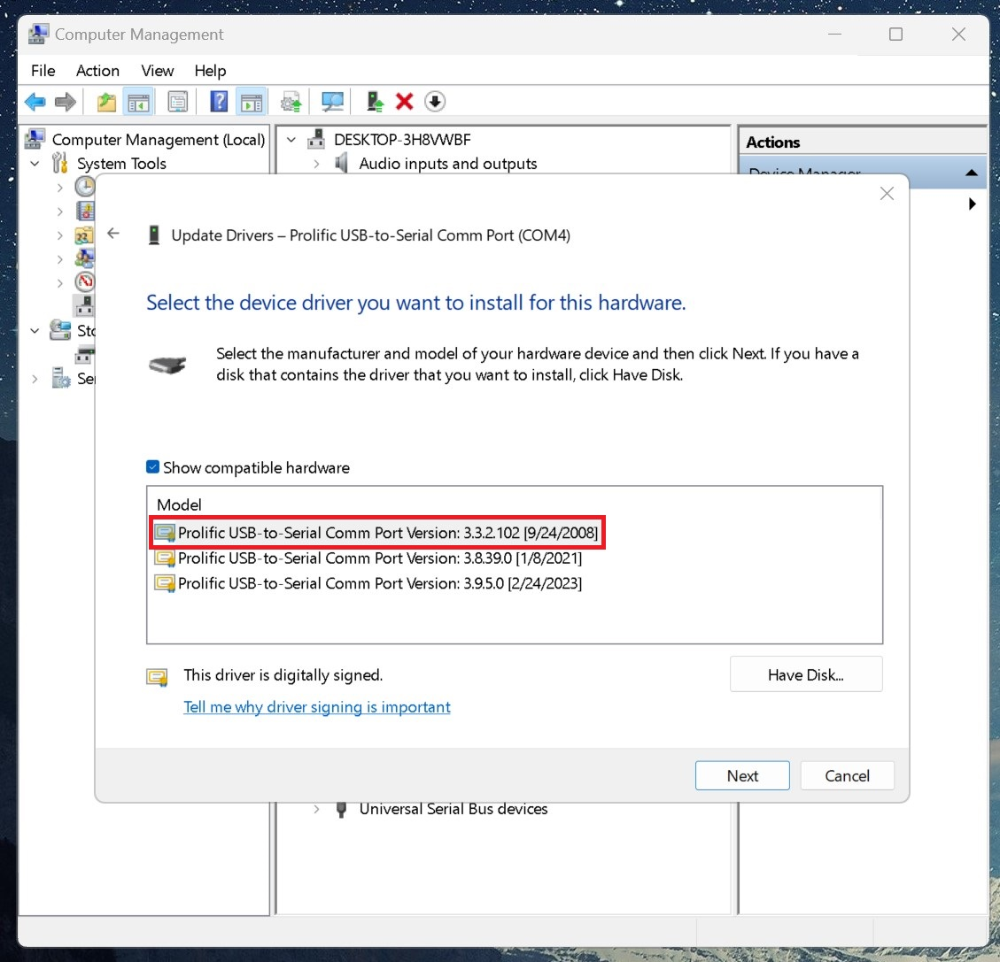](img/16.jpg)

Download and install then select the driver for the module. (All files are in the GitHub repo)

The device should now show as **Prolific USB-to-Serial Comm Port**.

[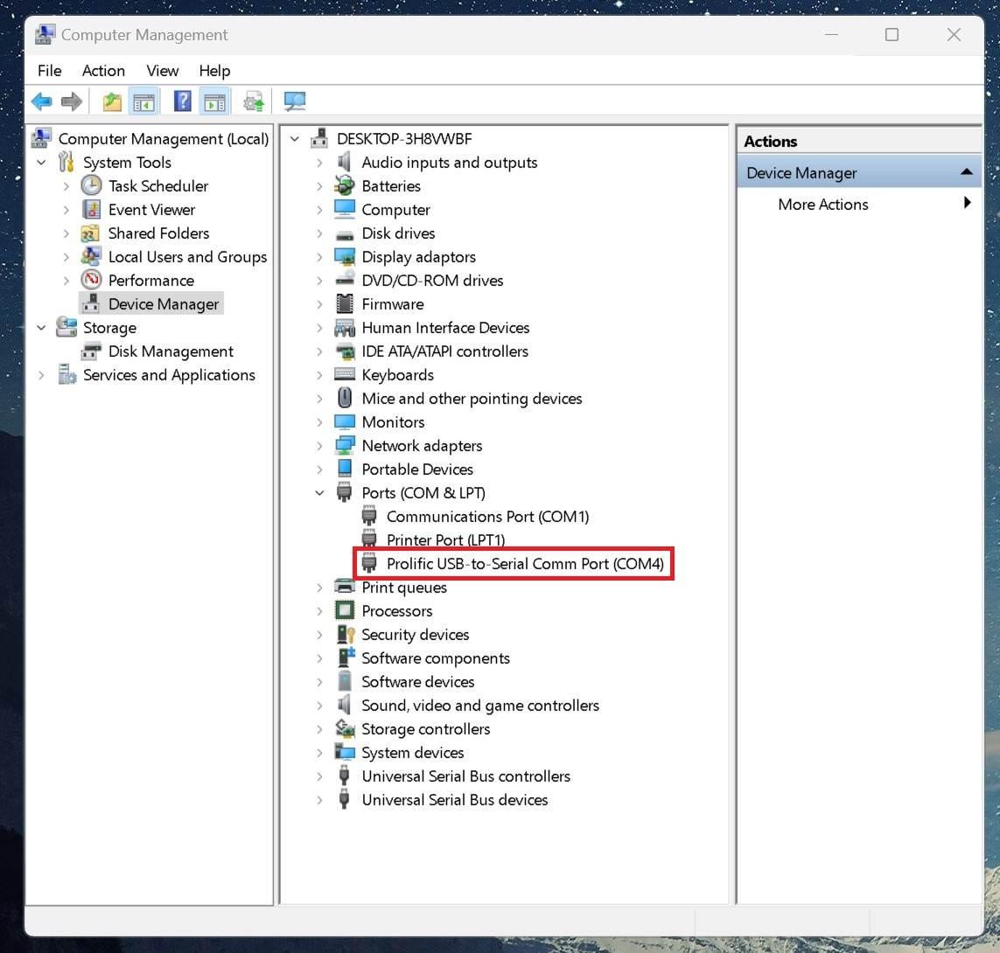](img/15.jpg)

---

### 3. Programming

Now plug the programming cable into the front of the **CM140** radio.

Open the **CPS** (*customer programming software*) for Motorola.

Make sure your preferences are set and your **COM** port can be found.

[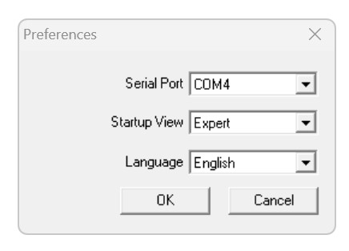](img/13.jpg)

Now in my case I did not have the code plug password or a saved code plug for my **CM140** radio.

[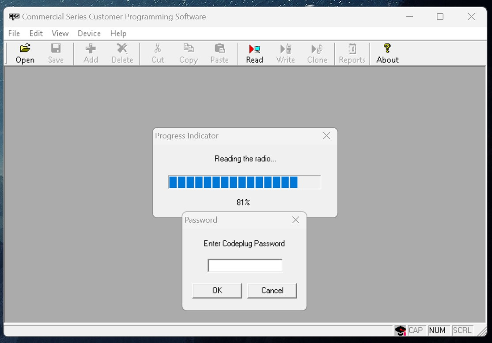](img/9.jpg)

[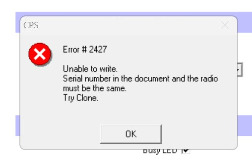](img/12.jpg)

Luckily I was able to find a sample code plug with my radios model number.

[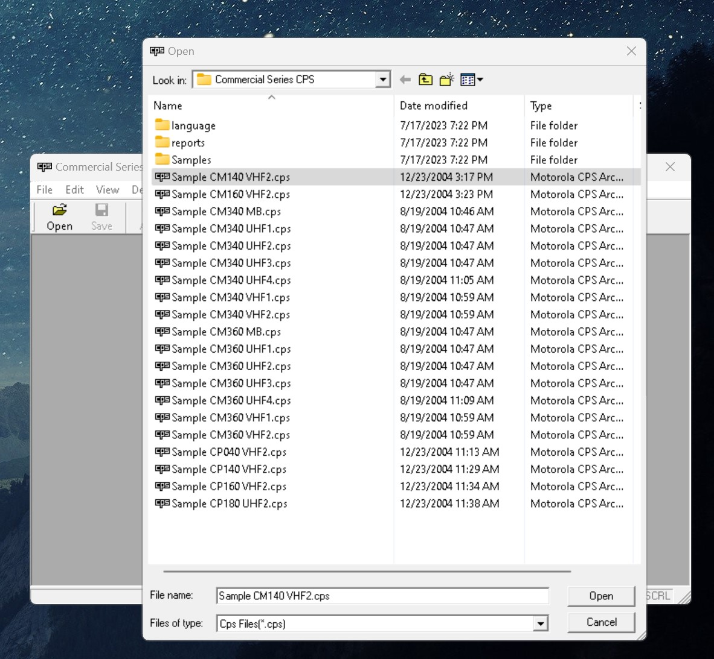](img/10.jpg)

Since the serial did not match I had to clone the radio first.

So I had to click read then cancle and then click on clone.

[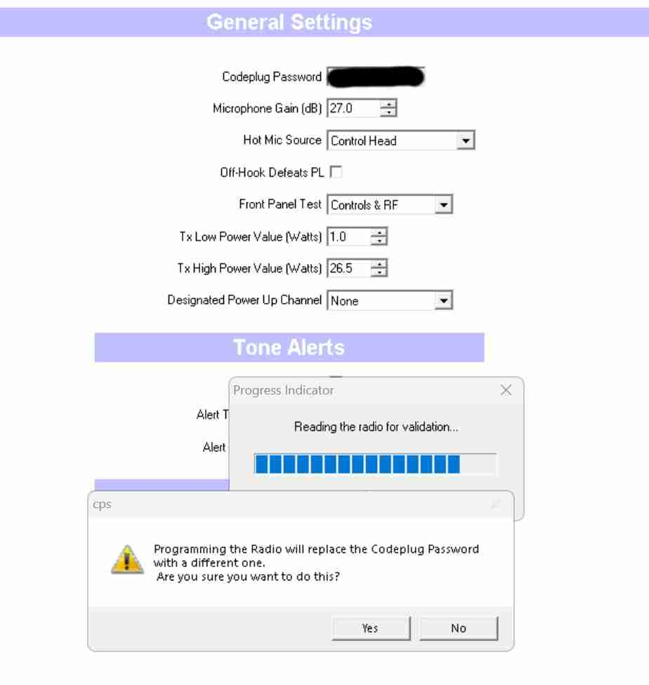](img/11.jpg)

Once I cloned the device I was able to save the code plug with a new password.

Now I can read and write to my radio without issue.

[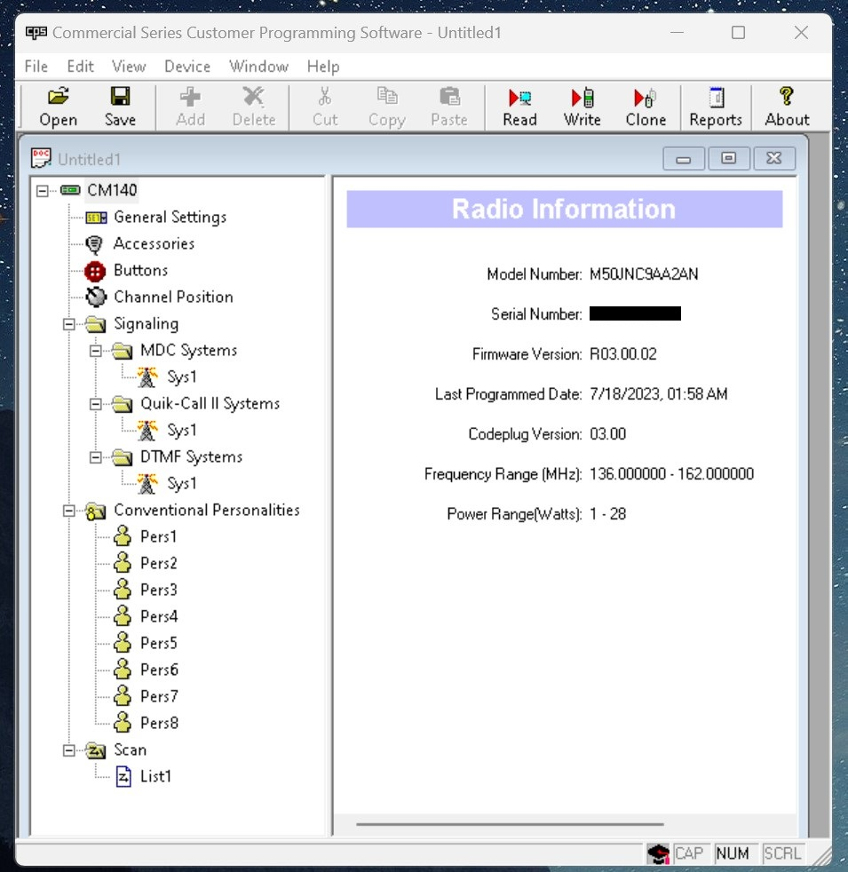](img/17.jpg)

# Links

* [Tutorial Article](https://tutorials.techrad.co.za/2023/07/18/motorola-cm140 "Tutorial Article")
* 

